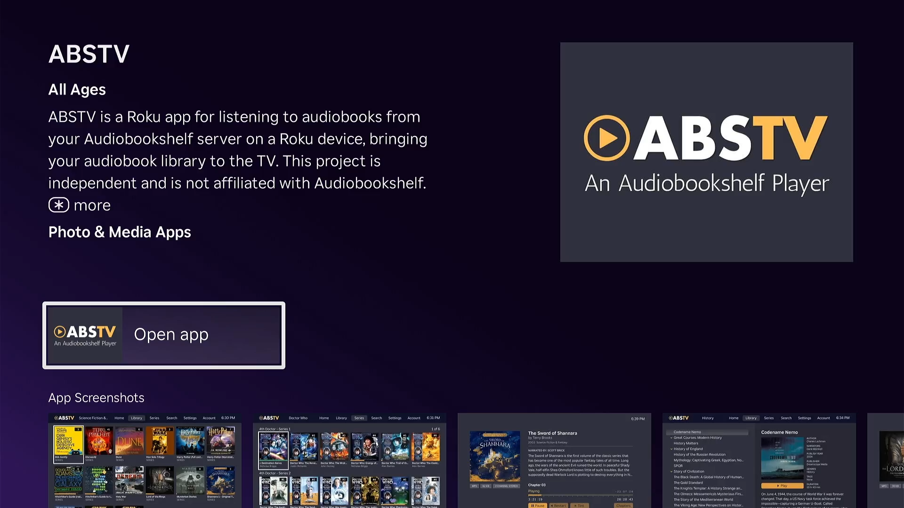

[](https://buymeacoffee.com/thedavidhoffman)

This project is open source, and contributions are welcome. If you're interested in improving this app, please consider opening an issue or pull request here rather than creating a separate forked version. Keeping development centered in this repository helps avoid duplicate work, makes improvements easier for everyone to find, and gives the community a single place to collaborate.

Forks are part of open source but if your goal is to fix bugs, add features, or improve compatibility, contributing those changes back here is greatly appreciated.

# ABSTV

This is a Roku app that connects to an [Audiobookshelf](https://www.audiobookshelf.org/) server to play audiobooks on a Roku device, bringing your audiobook library to your television. As far as I'm aware, this is the only Roku app for ABS. _This project is not affiliated with Audiobookshelf._

```
NOTE: this app currently does not support: podcasts, collections, or playlists.
```


## Installing

ABSTV is available in the Roku channel store.
1. From the Roku menu select `Streaming Store`
2. Select `Search`
3. Search for `ABSTV`

*Screenshot for ABSTV in the Roku Streaming Store.*


## Legal/Policies

- [License](LICENSE)
- [Privacy Policy](PRIVACY-POLICY.md)
- [Terms of Use](TERMS-OF-USE.md)

## AI Usage Disclaimer

This app was built with Codex, but it was not simply “vibe coded.” As a senior software engineer, I used AI to accelerate development while staying deeply involved in the implementation. The commit history on this repository reflects an active, hands-on process of guiding the work, refining generated code, making design decisions, and shaping the project toward a deliberate standard within the constraints of Roku’s BrightScript ecosystem.
