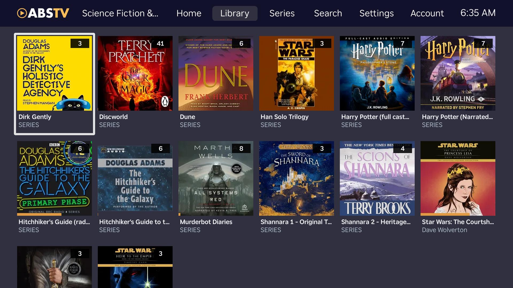
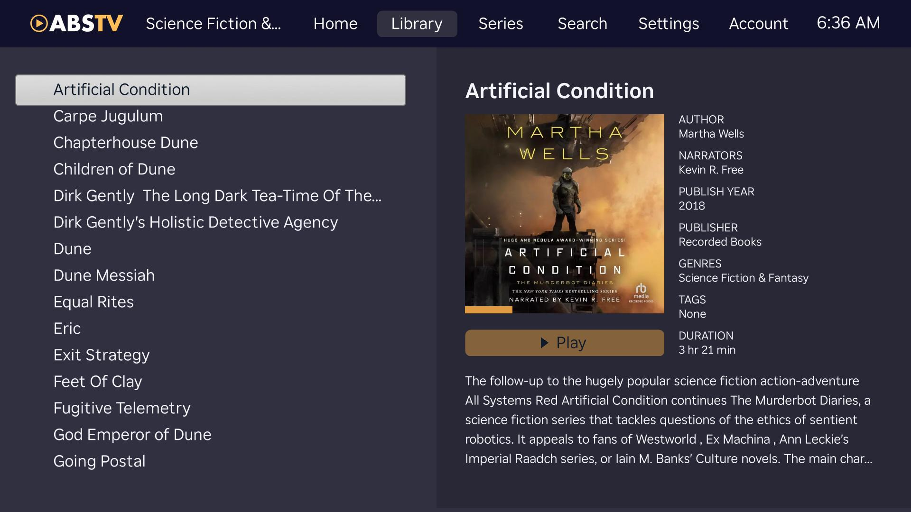
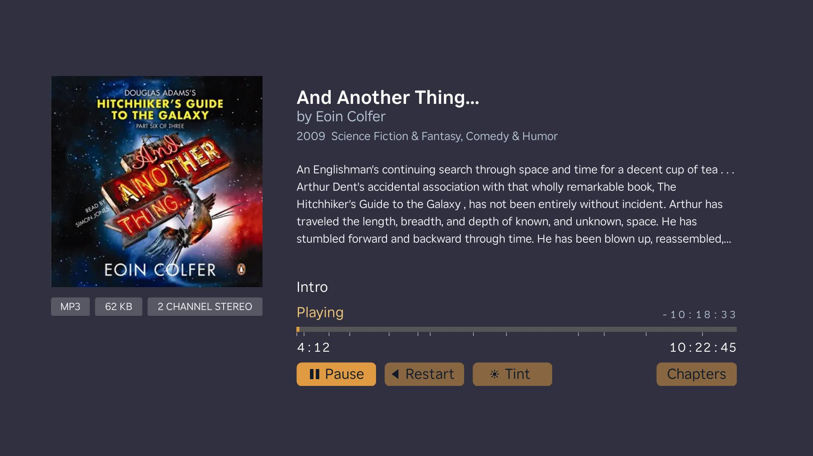

This project is open source, and contributions are welcome. If you're interested in improving this app, please consider opening an issue or pull request here rather than creating a separate forked version. Keeping development centered in this repository helps avoid duplicate work, makes improvements easier for everyone to find, and gives the community a single place to collaborate.

Forks are part of open source but if your goal is to fix bugs, add features, or improve compatibility, contributing those changes back here is greatly appreciated.

# ABSTV

This is a Roku app that connects to an [Audiobookshelf](https://www.audiobookshelf.org/) server to play audiobooks on a Roku device, bringing your audiobook library to your television. As far as I'm aware, this is the only Roku app for ABS. _This project is not affiliated with Audiobookshelf._

NOTE: this app currently does not support: podcasts, collections, or playlists.

## Table of Contents

- [Preview](#preview)
- [Installing](#installing)
- [AI Usage Disclaimer](#ai-usage-disclaimer)
- [Privacy Policy](#privacy-policy)
- [Wishlist](#wishlist)

## Installing

This app is not available in the official Roku Channel Store, so it must be side-loaded onto your Roku device. If you setup the ABS Docker image, you have enough technical experience to handle this process. Side-loading can sound a little intimidating at first, but it's actually pretty straightforward.

### Video Instructions

The official Roku Developer YouTube channel has a helpful video that walks through how to sideload a Roku app. You can skip the intro; this link starts at the 26-second mark.

https://youtu.be/r9HhUIWA4L0?si=OGK6Tm1SdCcLLhN-&t=26

### Written Instructions

1. On the Roku remote, press `Home` three times, `Up` two times, then `Right`, `Left`, `Right`, `Left`, `Right`.
2. Follow the on-screen prompts to enable the Developer Application Installer.
3. When the "Developer Settings" screen displays...
   - Note the `IP address`.
   - Note the username (it's always `rokudev`)
4. Read and accept the license agreement.
5. Set and note the developer web server password.
6. Restart the Roku device when prompted.

After the Roku device restarts, upload the ABSTV app:

1. Find the Roku IP address under `Settings > Network > About`.
2. Download the ABSTV app zip file from the latest GitHub release.
3. In a browser, open `http://ROKU_IP_ADDRESS`.
4. Sign in with username `rokudev` and the developer password you set.
5. Use the upload form to select the ABSTV zip file from the most current release in this GitHub repository, then click `Install`.

After installation, ABSTV will be available from the Roku home screen.

## AI Usage Disclaimer

This app was built with Codex, but it was not simply “vibe coded.” As a senior software engineer, I used AI to accelerate development while staying deeply involved in the implementation. The commit history on this repository reflects an active, hands-on process of guiding the work, refining generated code, making design decisions, and shaping the project toward a deliberate standard within the constraints of Roku’s BrightScript ecosystem.

## Privacy Policy

- No analytics or tracking services are used.
- No personal data is collected.
- The only information stored by this app on your Roku device are:
  - Your username, user id, and authentication token required to communicate with the ABS server.
  - Application settings.
- No data is shared with third parties.

## Wishlist

Things I hope to add support to this app for in the future.

- localization
- themes
- usage stat page
- collections
- playlists
- custom screensaver(s)
